# 1. Database Schema

**Engine:** PostgreSQL 16. **Access:** Prisma ORM (migrations + type-safe client).
**Conventions:**
- Primary keys are UUID v7 (`id`), time-sortable.
- All tables carry `created_at timestamptz not null default now()` and `updated_at timestamptz`.
- Soft deletes via `deleted_at timestamptz null` where content must be recoverable (courses, users, comments).
- Money stored as `integer` **minor units** (cents) + `currency char(3)` — never floats.
- Enums implemented as Postgres `enum` types (or `text` + `CHECK` for fast evolution).

---

## 1.1 Entity overview

Derived from `src/types/index.ts` plus backend-only concerns (auth tokens, payments, media).

**Identity & access:** `users`, `roles`, `permissions`, `role_permissions`, `user_roles`, `refresh_tokens`, `auth_sessions`, `login_history`, `email_verifications`, `password_resets`, `two_factor_secrets`.

**Catalog:** `categories`, `courses`, `modules`, `lessons`, `lesson_resources`, `course_tags`, `tags`, `instructor_profiles`.

**Learning:** `enrollments`, `lesson_progress`, `bookmarks`, `notes`, `wishlists`, `reviews`.

**Assessment:** `quizzes`, `quiz_questions`, `quiz_attempts`, `quiz_answers`, `assignments`, `assignment_submissions`.

**Credentials:** `certificates`.

**Engagement:** `notifications`, `conversations`, `conversation_participants`, `messages`, `message_attachments`, `calendar_events`, `achievements`, `user_achievements`, `announcements`, `discussions`, `discussion_comments`.

**Commerce:** `plans`, `subscriptions`, `orders`, `order_items`, `payments`, `coupons`, `payouts`, `instructor_earnings`.

**Platform:** `media_assets`, `audit_logs`, `notification_preferences`, `feature_flags`, `webhooks_events`.

---

## 1.2 ER diagram (core)

```mermaid
erDiagram
  users ||--o{ user_roles : has
  roles ||--o{ user_roles : assigned
  roles ||--o{ role_permissions : grants
  permissions ||--o{ role_permissions : in
  users ||--o{ refresh_tokens : owns
  users ||--o{ auth_sessions : opens
  users ||--o{ login_history : records
  users ||--|| instructor_profiles : "may have"

  categories ||--o{ courses : classifies
  users ||--o{ courses : teaches
  courses ||--o{ modules : contains
  modules ||--o{ lessons : contains
  lessons ||--o{ lesson_resources : has
  courses ||--o{ course_tags : tagged
  tags ||--o{ course_tags : on

  users ||--o{ enrollments : enrolls
  courses ||--o{ enrollments : has
  enrollments ||--o{ lesson_progress : tracks
  lessons ||--o{ lesson_progress : for
  users ||--o{ bookmarks : saves
  lessons ||--o{ bookmarks : of
  users ||--o{ notes : writes
  lessons ||--o{ notes : on
  users ||--o{ wishlists : keeps
  courses ||--o{ wishlists : in
  users ||--o{ reviews : posts
  courses ||--o{ reviews : receives

  courses ||--o{ quizzes : offers
  quizzes ||--o{ quiz_questions : has
  users ||--o{ quiz_attempts : takes
  quizzes ||--o{ quiz_attempts : of
  quiz_attempts ||--o{ quiz_answers : contains
  quiz_questions ||--o{ quiz_answers : answered

  courses ||--o{ assignments : sets
  assignments ||--o{ assignment_submissions : receives
  users ||--o{ assignment_submissions : submits

  users ||--o{ certificates : earns
  courses ||--o{ certificates : for

  users ||--o{ notifications : receives
  users ||--o{ conversation_participants : joins
  conversations ||--o{ conversation_participants : has
  conversations ||--o{ messages : contains
  users ||--o{ messages : sends
  messages ||--o{ message_attachments : has

  users ||--o{ user_achievements : unlocks
  achievements ||--o{ user_achievements : awarded

  plans ||--o{ subscriptions : billed
  users ||--o{ subscriptions : holds
  users ||--o{ orders : places
  orders ||--o{ order_items : has
  courses ||--o{ order_items : purchased
  orders ||--o{ payments : paid_by
  users ||--o{ payouts : receives

  users ||--o{ audit_logs : actor
  media_assets ||--o{ lessons : "video for"
```

---

## 1.3 Table definitions

Only columns beyond the standard `id / created_at / updated_at` are listed unless noteworthy. Types are Postgres.

### Identity & access

**users**
| column | type | notes |
| --- | --- | --- |
| id | uuid PK | |
| name | text not null | |
| email | citext not null | **UNIQUE** |
| password_hash | text | null for OAuth-only accounts |
| avatar_url | text | → `media_assets` |
| headline | text | |
| bio | text | |
| location | text | |
| skills | text[] | |
| status | user_status | `active \| suspended \| invited \| deactivated` |
| email_verified_at | timestamptz | |
| two_factor_enabled | boolean default false | |
| last_login_at | timestamptz | |
| deleted_at | timestamptz | soft delete |

Indexes: `UNIQUE(email)`, `INDEX(status)`, `INDEX(deleted_at)`.

**roles** — `id`, `key` (`admin \| instructor \| student`) UNIQUE, `name`, `description`.
**permissions** — `id`, `key` (e.g. `course.publish`, `user.manage`) UNIQUE, `description`.
**role_permissions** — PK `(role_id, permission_id)`; FKs to `roles`, `permissions`.
**user_roles** — PK `(user_id, role_id)`; FKs to `users`, `roles`. (Many-to-many; a user may hold several roles.)

**refresh_tokens**
| column | type | notes |
| --- | --- | --- |
| id | uuid PK | |
| user_id | uuid FK→users | ON DELETE CASCADE |
| token_hash | text not null | SHA-256 of the opaque token |
| family_id | uuid | rotation family (reuse detection) |
| expires_at | timestamptz | |
| revoked_at | timestamptz | |
| user_agent | text | |
| ip | inet | |

Indexes: `UNIQUE(token_hash)`, `INDEX(user_id)`, `INDEX(family_id)`.

**auth_sessions** — active devices (frontend "Active sessions"): `user_id FK`, `device`, `browser`, `ip inet`, `location`, `last_active_at`, `current boolean`, `refresh_token_id FK`.
**login_history** — `user_id FK`, `at`, `device`, `location`, `ip inet`, `status` (`success \| failed`), `reason`.
**email_verifications** / **password_resets** — `user_id FK`, `token_hash`, `expires_at`, `used_at`.
**two_factor_secrets** — `user_id FK UNIQUE`, `secret_encrypted`, `recovery_codes text[]`, `confirmed_at`.

### Catalog

**categories** — `id`, `name`, `slug UNIQUE`, `icon`, `parent_id FK→categories` (nullable, for subcategories), `course_count int` (denormalized).
**instructor_profiles** — `user_id PK/FK`, `title`, `headline`, `total_students int`, `avg_rating numeric(2,1)`, `payout_method jsonb`, `stripe_account_id`.

**courses**
| column | type | notes |
| --- | --- | --- |
| id | uuid PK | |
| slug | text | **UNIQUE** |
| title | text not null | |
| subtitle | text | |
| description | text | |
| category_id | uuid FK→categories | |
| instructor_id | uuid FK→users | |
| level | course_level | `beginner \| intermediate \| advanced` |
| price_cents | integer default 0 | 0 = free |
| currency | char(3) default 'USD' | |
| status | course_status | `draft \| in_review \| published \| archived` |
| thumbnail_id | uuid FK→media_assets | |
| rating_avg | numeric(2,1) default 0 | denormalized from reviews |
| rating_count | integer default 0 | |
| students_count | integer default 0 | denormalized |
| duration_seconds | integer default 0 | sum of lessons |
| published_at | timestamptz | |
| deleted_at | timestamptz | |

Indexes: `UNIQUE(slug)`, `INDEX(category_id)`, `INDEX(instructor_id)`, `INDEX(status, published_at)`, `INDEX(rating_avg)`, GIN full-text index on `(title, subtitle)`.

**modules** — `course_id FK`, `title`, `position int`. Index `(course_id, position)`.
**lessons**
| column | type | notes |
| --- | --- | --- |
| id | uuid PK | |
| module_id | uuid FK→modules | ON DELETE CASCADE |
| title | text | |
| type | lesson_type | `video \| reading \| quiz` |
| position | int | |
| duration_seconds | int | |
| is_preview | boolean default false | |
| media_asset_id | uuid FK→media_assets | video |
| quiz_id | uuid FK→quizzes | when type=quiz |
| transcript | text | |
| content_md | text | for reading lessons |

Index `(module_id, position)`.

**lesson_resources** — `lesson_id FK`, `label`, `media_asset_id FK`, `size_bytes bigint`.
**tags** — `id`, `name UNIQUE`. **course_tags** — PK `(course_id, tag_id)`.

### Learning

**enrollments**
| column | type | notes |
| --- | --- | --- |
| id | uuid PK | |
| user_id | uuid FK→users | |
| course_id | uuid FK→courses | |
| status | enrollment_status | `not_started \| in_progress \| completed` |
| progress_pct | smallint default 0 | 0–100 denormalized |
| last_lesson_id | uuid FK→lessons | |
| completed_at | timestamptz | |
| last_accessed_at | timestamptz | |
| source | text | `purchase \| subscription \| free` |

Indexes: `UNIQUE(user_id, course_id)`, `INDEX(user_id, status)`, `INDEX(course_id)`.

**lesson_progress** — PK `(enrollment_id, lesson_id)`; `completed boolean`, `watched_seconds int`, `completed_at`. Index `(enrollment_id)`.
**bookmarks** — `UNIQUE(user_id, lesson_id)`.
**notes** — `user_id FK`, `lesson_id FK`, `timestamp_seconds int`, `content text`. Index `(user_id, lesson_id)`.
**wishlists** — PK `(user_id, course_id)`.
**reviews** — `user_id FK`, `course_id FK`, `rating smallint CHECK (1..5)`, `body text`. `UNIQUE(user_id, course_id)`; trigger recomputes `courses.rating_avg/count`.

### Assessment

**quizzes** — `course_id FK`, `title`, `description`, `duration_minutes int`, `passing_score smallint`, `max_attempts int null`, `shuffle boolean`.
**quiz_questions**
| column | type | notes |
| --- | --- | --- |
| id | uuid PK | |
| quiz_id | uuid FK→quizzes | |
| type | question_type | `single \| multi \| boolean \| fill \| code` |
| prompt | text | |
| options | jsonb | array of strings (choice types) |
| correct | jsonb | `int[]` indices, or string for fill/code |
| explanation | text | |
| points | smallint | |
| position | int | |

> **Security:** `correct` is **never** serialized to student-facing responses — see [Quiz Engine](./06-quiz-and-assignments.md#quiz-engine).

**quiz_attempts** — `quiz_id FK`, `user_id FK`, `score smallint`, `passed boolean`, `started_at`, `submitted_at`, `duration_seconds`. Index `(user_id, quiz_id)`.
**quiz_answers** — `attempt_id FK`, `question_id FK`, `answer jsonb`, `is_correct boolean`, `points_awarded smallint`.

**assignments** — `course_id FK`, `title`, `description`, `due_at timestamptz`, `points smallint`, `allow_late boolean`.
**assignment_submissions**
| column | type | notes |
| --- | --- | --- |
| id | uuid PK | |
| assignment_id | uuid FK | |
| user_id | uuid FK | |
| status | submission_status | `pending \| submitted \| graded \| overdue` |
| submitted_at | timestamptz | |
| grade | smallint | |
| feedback | text | |
| graded_by | uuid FK→users | |
| graded_at | timestamptz | |
| attachments | jsonb | `[{media_asset_id,name,size}]` |

Indexes: `UNIQUE(assignment_id, user_id)`, `INDEX(assignment_id, status)`.

### Credentials, engagement, commerce

**certificates** — `user_id FK`, `course_id FK`, `credential_id text UNIQUE`, `grade text`, `issued_at`, `pdf_media_id FK→media_assets`, `verification_hash`. Index `UNIQUE(user_id, course_id)`, `UNIQUE(credential_id)`.

**notifications** — `user_id FK`, `type notification_type`, `title`, `body`, `href`, `read_at timestamptz`, `data jsonb`. Index `(user_id, read_at)`, `(user_id, created_at DESC)`.
**notification_preferences** — `user_id PK/FK`, `email jsonb`, `push jsonb`, `in_app jsonb` (per-category booleans).
**conversations** — `id`, `type` (`direct \| group`), `last_message_at`. **conversation_participants** — PK `(conversation_id, user_id)`, `unread_count int`, `last_read_at`.
**messages** — `conversation_id FK`, `sender_id FK`, `body text`, `created_at`. Index `(conversation_id, created_at DESC)`. **message_attachments** — `message_id FK`, `media_asset_id FK`.
**calendar_events** — `user_id FK` (or `course_id FK`), `title`, `type` (`deadline \| live_class \| assignment \| quiz`), `starts_at`, `ends_at`, `ref_type`, `ref_id`.
**achievements** — `key UNIQUE`, `title`, `description`, `icon`, `criteria jsonb`. **user_achievements** — PK `(user_id, achievement_id)`, `unlocked_at`.
**announcements** — `instructor_id FK`, `course_id FK`, `title`, `body`, `published_at`.
**discussions** / **discussion_comments** — threaded Q&A under a `lesson_id`/`course_id`; `author_id FK`, `parent_id FK` (self), `body`, `upvotes int`.

**plans** — `key`, `name`, `price_cents`, `interval` (`month \| year`), `features jsonb`, `stripe_price_id`.
**subscriptions** — `user_id FK`, `plan_id FK`, `status` (`trialing \| active \| past_due \| canceled`), `current_period_end`, `cancel_at_period_end boolean`, `stripe_subscription_id`.
**orders** — `user_id FK`, `status` (`pending \| paid \| failed \| refunded`), `total_cents`, `currency`, `coupon_id FK`. **order_items** — `order_id FK`, `course_id FK`, `price_cents`.
**payments** — `order_id FK`, `provider` (`stripe`), `provider_payment_id`, `amount_cents`, `status`, `raw jsonb`. Index `UNIQUE(provider, provider_payment_id)`.
**coupons** — `code UNIQUE`, `type` (`percent \| fixed`), `value`, `max_redemptions`, `redeemed int`, `expires_at`.
**payouts** — `instructor_id FK`, `amount_cents`, `status`, `method`, `period_start`, `period_end`, `paid_at`.
**instructor_earnings** — ledger: `instructor_id FK`, `order_item_id FK`, `gross_cents`, `platform_fee_cents`, `net_cents`, `available_at`.

### Platform

**media_assets** — `id`, `owner_id FK→users`, `kind` (`video \| image \| pdf \| archive \| doc`), `bucket`, `key`, `mime`, `size_bytes bigint`, `status` (`uploading \| processing \| ready \| failed`), `duration_seconds`, `variants jsonb` (HLS renditions), `checksum`. Index `(owner_id)`, `(kind, status)`.
**audit_logs** — `actor_id FK→users`, `action text`, `entity_type`, `entity_id`, `ip inet`, `user_agent`, `metadata jsonb`, `at`. Index `(actor_id, at DESC)`, `(entity_type, entity_id)`. Append-only (see [Audit Logging](./09-security-audit-ratelimit.md#audit-logging)).
**feature_flags** — `key UNIQUE`, `enabled boolean`, `rollout jsonb`.
**webhook_events** — `provider`, `event_id UNIQUE`, `payload jsonb`, `processed_at` (idempotency for Stripe etc.).

---

## 1.4 Indexing strategy summary

- **Lookup keys:** every FK is indexed; unique business keys (`email`, `slug`, `credential_id`, `code`) are unique-indexed.
- **List/sort hot paths:** `enrollments(user_id, status)`, `notifications(user_id, created_at DESC)`, `messages(conversation_id, created_at DESC)`, `courses(status, published_at)`, `audit_logs(actor_id, at DESC)`.
- **Full-text search:** GIN index on `courses` title/subtitle/description as a fallback; primary search is the external engine (§19).
- **Composite uniqueness** enforces one-per-relationship rules: `enrollments(user_id,course_id)`, `reviews(user_id,course_id)`, `wishlists(user_id,course_id)`, `bookmarks(user_id,lesson_id)`, `certificates(user_id,course_id)`.
- **Partial indexes** for common filters, e.g. `CREATE INDEX ON courses (published_at) WHERE status='published' AND deleted_at IS NULL`.
- **Denormalized counters** (`rating_avg`, `students_count`, `course_count`, `progress_pct`) are maintained by triggers or job workers to keep list endpoints O(1).
