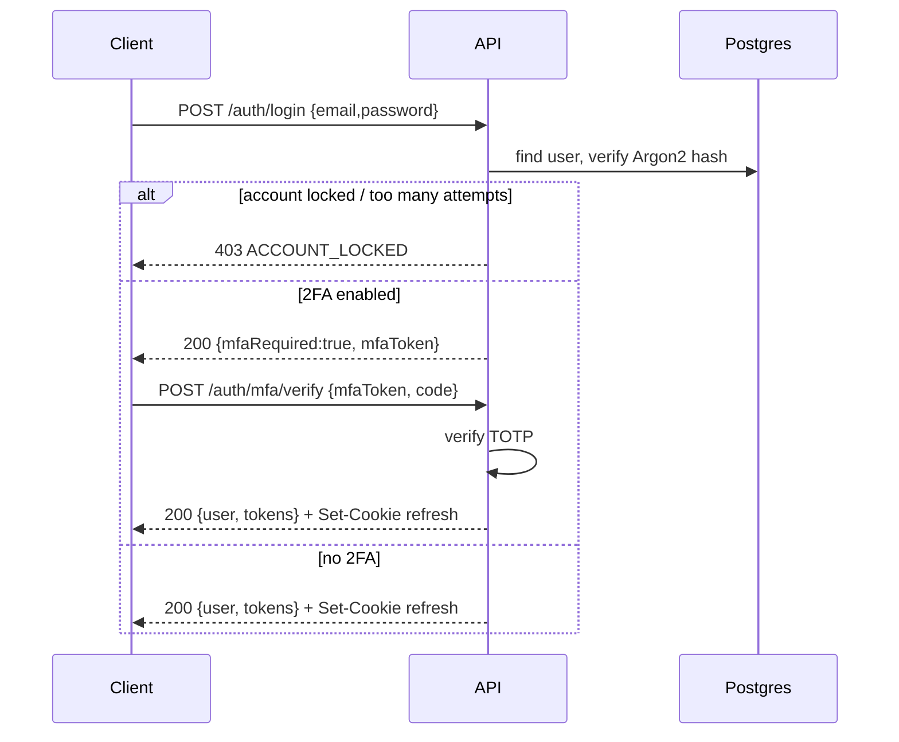
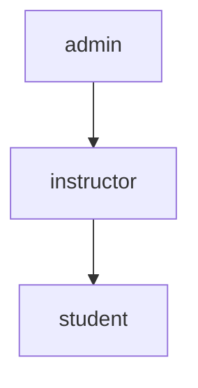

# 3. Authentication & Authorization Design

## 3.1 Token model (JWT + refresh)

Two-token scheme:

| Token | Lifetime | Storage (web) | Purpose |
| --- | --- | --- | --- |
| **Access token** | 15 min | in-memory (Zustand) | sent as `Authorization: Bearer`; stateless |
| **Refresh token** | 30 days (7 if "remember me" off) | **httpOnly, Secure, SameSite=Strict cookie** | mints new access tokens; rotated on use |

**Access token = signed JWT (RS256).** Asymmetric keys so downstream services verify with the public key without the signing secret. Payload:
```json
{
  "sub": "u_1", "sid": "sess_abc",
  "roles": ["student"], "scope": "student",
  "email_verified": true,
  "iat": 1753180800, "exp": 1753181700,
  "iss": "webhackacademy", "aud": "webhackacademy-api"
}
```
Keep JWTs small — **roles only**, not full permission lists; permissions are resolved server-side from roles (cached in Redis) so permission changes take effect on the next access token (≤15 min) without re-issuing everything.

**Refresh token = opaque random 256-bit string**, stored only as a SHA-256 hash in `refresh_tokens`. Never a JWT (must be revocable).

### Rotation & reuse detection
- Every `/auth/refresh` issues a **new** refresh token and revokes the presented one (same `family_id`).
- If a **already-revoked** token from a family is presented → token theft assumed → **revoke the entire family** and force re-login. Logged to `audit_logs` + security alert.

### Session lifecycle (maps to frontend)
- `auth_sessions` row per device powers the "Active sessions / device management" UI.
- `expireSession()` in the frontend store corresponds to a `401 TOKEN_EXPIRED` when refresh also fails → shows the **Session Expired** screen.
- Logout revokes the current refresh family and marks the `auth_session` closed.

## 3.2 Login flow (with optional MFA)



- **Password hashing:** Argon2id (fallback bcrypt cost 12). Never store plaintext.
- **Brute-force protection:** per-account + per-IP counters in Redis; exponential backoff; lock after N failures → `ACCOUNT_LOCKED` (frontend `/account-locked`). CAPTCHA challenge after threshold (frontend has the placeholder).
- **2FA:** TOTP (RFC 6238) via `two_factor_secrets`; recovery codes hashed. The frontend `/two-factor` + settings/security QR flow map directly.

## 3.3 Role-Based Access Control

### Roles (hierarchy)


| Role | Description | Representative permissions |
| --- | --- | --- |
| **student** | Default learner (assigned on signup) | `course.enroll`, `lesson.progress`, `quiz.attempt`, `assignment.submit`, `review.write`, `message.send`, `billing.purchase` |
| **instructor** | Creates & teaches courses | student + `course.create`, `course.edit:own`, `course.publish:own`, `quiz.manage:own`, `submission.grade:own`, `announcement.post:own`, `earnings.view:own`, `payout.request` |
| **admin** | Full platform control | everything: `user.manage`, `user.delete`, `course.publish`, `content.moderate`, `category.manage`, `course.feature`, `billing.refund`, `payout.process`, `report.generate`, `audit.view`, `role.manage`, `settings.manage` |

Roles are **additive** and multi-assignable (`user_roles` many-to-many). Effective permissions = union of all roles' permissions. The full capability matrix is in [15-permissions-matrix.md](./15-permissions-matrix.md).

### Permission resolution
1. Access token carries `roles[]`.
2. A guard resolves `roles → permissions` from a Redis-cached map (invalidated when `role_permissions` changes).
3. Route guards declare required permission(s): `@RequirePermissions('course.publish')`.
4. **Resource ownership** is a second check (`:own` scope) — e.g. an instructor may edit only their own course. Implemented as policy handlers comparing `resource.instructor_id === user.sub`.

### Enforcement layers
- **Middleware:** verify JWT signature + expiry, attach `req.user`.
- **RolesGuard:** coarse role gate.
- **PermissionsGuard:** fine permission gate.
- **PolicyGuard / row-level checks:** ownership & visibility (draft courses hidden from non-owners; locked lessons strip video URLs).
- **Field-level:** serializers omit sensitive fields per role (e.g. `quiz_questions.correct`, other users' emails).

### Frontend alignment
The role switcher and role-based sidebar (`src/constants/nav.ts`) are **presentation only**; the backend is the authority. Protected routes will be enforced by:
- Server: 401/403 on the API.
- Client: Next.js middleware guarding `/app/*`, redirecting unauthenticated users to `/login?redirect=` and role-mismatches to `/app/unauthorized`.

## 3.4 OAuth / social login (future-ready)
`GET /auth/oauth/:provider` → provider consent → callback creates/links a `users` row (password_hash null). "Connected accounts" settings UI maps here.

## 3.5 Security headers & cookies
- Refresh cookie: `HttpOnly; Secure; SameSite=Strict; Path=/v1/auth`.
- Access token never in localStorage (XSS-exfiltration risk) — held in memory; lost on full reload and re-minted via refresh cookie.
- CSRF: refresh endpoint additionally checks a double-submit token because it relies on a cookie.
