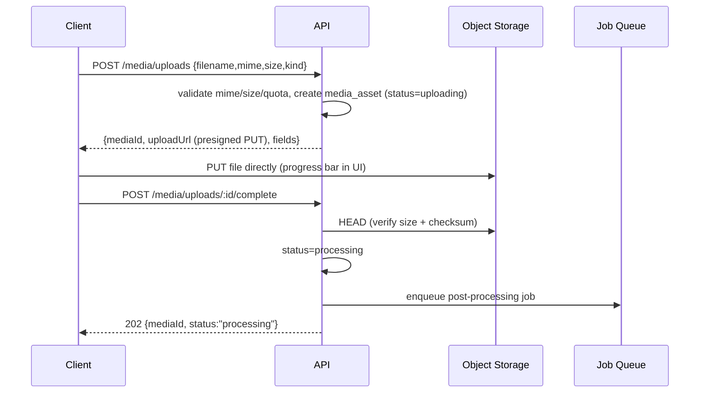

# 4. File Storage Strategy

All binary content lives in **S3-compatible object storage** (AWS S3 / Cloudflare R2 / MinIO for local), fronted by a **CDN** (CloudFront / Cloudflare). The database stores only metadata in `media_assets` — never blobs.

## 4.1 Upload flow (presigned, direct-to-storage)

Clients never stream large files through the API.

- **Validation:** mime allow-list per `kind`, max-size per kind, per-user storage quota, checksum verification.
- **Virus/malware scan** (ClamAV or provider) runs as the first processing step for user uploads (assignments, resources).
- **Multipart upload** for videos > 100 MB.

## 4.2 Asset classes

| Asset | Bucket / prefix | Access | Processing | Delivery |
| --- | --- | --- | --- | --- |
| **Course videos** | `wha-video/` (private) | signed | Transcode → HLS (240p–1080p) + thumbnails + captions; store renditions in `variants` | HLS via CDN with **short-lived signed URLs**; DRM/token per playback session |
| **Certificates (PDF)** | `wha-certificates/` (private) | signed | Generated by job (§9); immutable | signed URL, 5-min expiry; public verify uses hash not the file |
| **Profile images** | `wha-avatars/` (public-read via CDN) | public | Resize to 64/128/256, WebP/AVIF, strip EXIF | CDN, long cache, cache-busting on change |
| **Assignment submissions** | `wha-submissions/` (private) | signed | Malware scan; no transform | signed URL to owner + course instructor + admins only |
| **Course resources** (slides, zips) | `wha-resources/` (private) | signed | Malware scan | signed URL only to enrolled students / owner |
| **Message attachments** | `wha-messages/` (private) | signed | scan + image resize | signed URL to conversation participants |

## 4.3 Video pipeline (detail)

1. Raw upload → `wha-video/raw/{id}`.
2. Transcoding job (AWS MediaConvert / `ffmpeg` workers) produces HLS ladder + poster + WebVTT (auto-captions optional via speech-to-text).
3. Outputs → `wha-video/hls/{id}/...`; `media_assets.variants` records renditions & durations; `status=ready`.
4. `lessons.duration_seconds` updated; enrollment progress uses `watched_seconds` posted by the player.
5. Playback: `GET /media/:id` issues a **playback token** (short-lived, bound to user + session + IP class) → CDN signed cookie/URL for the `.m3u8` and segments. Prevents hotlinking and casual download.

## 4.4 Signed delivery & authorization

- Private objects are **never** public. `GET /media/:id` performs an authorization check (ownership / enrollment / role) then returns a URL signed for 5–15 minutes.
- Ownership matrix enforced in code, e.g. a submission file is visible to: submitting student, the course's instructor, and admins.

## 4.5 Lifecycle, backup, cost

- **Lifecycle rules:** raw video deleted after successful transcode; incomplete uploads (`status=uploading` > 24h) garbage-collected by a nightly job.
- **Storage classes:** hot (Standard) for active course media; infrequent-access for old certificates.
- **Versioning + cross-region replication** on certificate & submission buckets (compliance/recoverability).
- **CDN caching:** public avatars cached aggressively; signed private URLs are `Cache-Control: private, no-store` at the edge except HLS segments (cacheable, protected by signed cookies).
- **Quotas:** per-instructor storage limits; per-student submission size caps.
