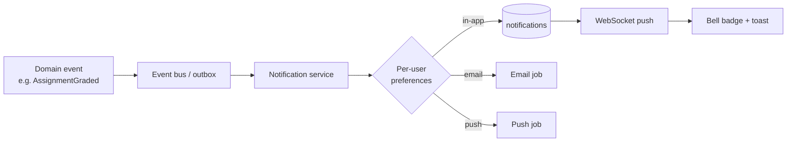
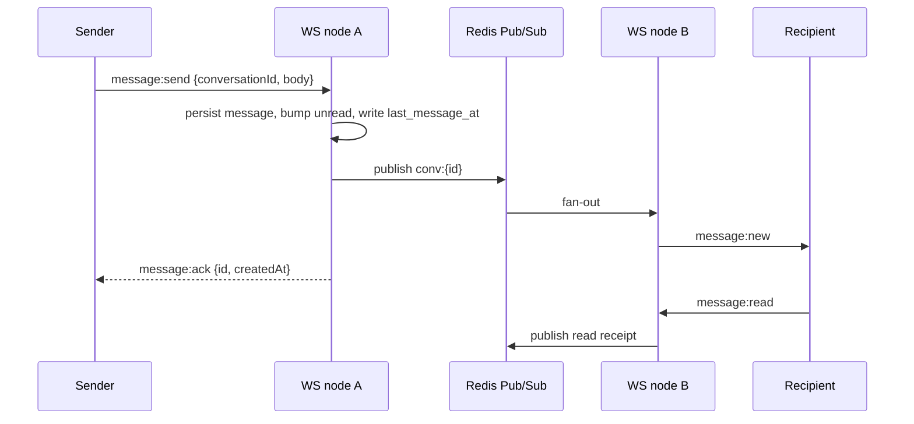

# 5 & 6. Notifications and Messaging

## Notification System

Powers the frontend notification bell, `/app/notifications` center, and preference toggles.

### Channels
| Channel | Transport | Use |
| --- | --- | --- |
| **In-app** | `notifications` table + WS push | bell + center |
| **Email** | provider (SES/Postmark) via job | digests, receipts, grades |
| **Push** | Web Push / FCM | real-time re-engagement |
| **SMS** (optional) | Twilio | security alerts only |

### Pipeline

- **Event-driven:** domain services emit events (`AssignmentGraded`, `LessonPublished`, `MessageReceived`, `NewDeviceLogin`, `AchievementUnlocked`, `PaymentSucceeded`). A **transactional outbox** guarantees an event is recorded in the same DB transaction as the state change, then relayed to the bus (no lost notifications).
- **Templating:** each notification `type` has a template (title/body/href/icon) rendered with `data jsonb`. Matches the frontend `NotificationType` union (`course|assignment|quiz|message|system|achievement`).
- **Preferences:** `notification_preferences` gates each `(type, channel)`; the settings UI writes here. Security notifications ignore preferences (always delivered).
- **Read state:** `read_at`; `POST /notifications/:id/read`, `POST /notifications/read-all`. Unread count is `count(read_at IS NULL)` cached in Redis and pushed over WS so the badge updates live.
- **Delivery:** in-app is immediate; email/push are jobs with retry + backoff; digest emails are a scheduled job aggregating unread items.
- **Dedup & rate:** collapse duplicates (e.g. many messages → one "3 new messages"); cap email frequency per user.

### API
`GET /notifications?unread=&cursor=`, `POST /notifications/:id/read`, `POST /notifications/read-all`, `GET/PUT /users/me/preferences`.

---

## Messaging System

Powers `/app/messages` — conversation list, chat thread, unread counts, typing indicator, attachments.

### Data
`conversations` (direct/group), `conversation_participants` (per-user unread + last_read), `messages`, `message_attachments`. Current user id in the frontend (`u_1`) becomes `sender_id`.

### Realtime transport
- **WebSocket gateway** at `WSS /v1/realtime`, authenticated by a short-lived WS ticket (`POST /realtime/ticket` returns a signed token; avoids sending the JWT in the URL).
- **Redis Pub/Sub** (or Redis Streams) fans messages across horizontally-scaled WS nodes so any node can deliver to any connected participant.

### Events
- Client→server: `message:send`, `typing:start`, `typing:stop`, `message:read`, `presence:ping`.
- Server→client: `message:new`, `message:ack`, `typing`, `read:receipt`, `presence:update`, `conversation:updated`.
- **Typing indicator:** ephemeral `typing` events (not persisted), debounced; the frontend's simulated typing dots become real.
- **Presence:** `online` flag via heartbeat + Redis TTL key per user; drives the avatar online dot.

### Delivery guarantees & history
- Messages persisted before ack (at-least-once to clients; client de-dups by id).
- Offline recipients get a `message` **notification** (via the notification pipeline) + push.
- History via `GET /conversations/:id/messages?cursor=` (cursor pagination, newest-first).
- Attachments: upload via presigned flow (§4), then send message referencing `mediaId`s.

### Moderation & limits
- Rate-limit sends per user; block/report endpoints; profanity/spam filtering hook; instructors can message their enrolled students, students can message their instructors (authorization policy on conversation creation).
