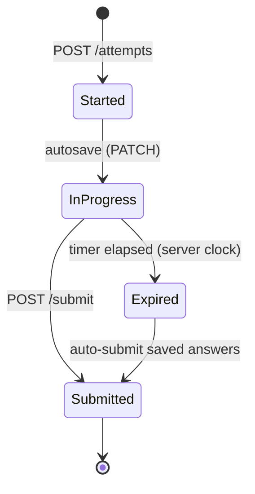
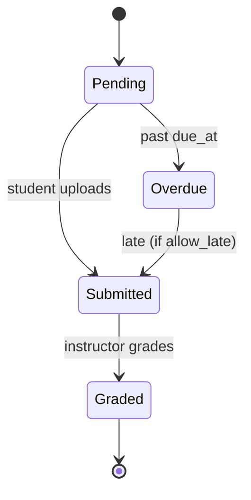

# 7 & 8. Quiz Engine and Assignment System

## Quiz Engine

Backs `/app/quizzes` and the runner. Supports the frontend's 5 question types: `single`, `multi`, `boolean`, `fill`, `code`.

### Core rule: never trust the client
- `GET /quizzes/:id` returns questions **with the `correct` field stripped** (serializer omits it for students; instructors/admins see it).
- Grading happens **only server-side** on submit. The frontend's mock `quizService.submit` grading logic is illustrative; the real engine re-implements it authoritatively.

### Attempt lifecycle

- **Start:** `POST /quizzes/:id/attempts` creates a `quiz_attempts` row with `started_at` and server-computed `ends_at = started_at + duration`. Enforces `max_attempts`.
- **Timing is server-authoritative:** the client timer is cosmetic; on submit the server rejects/auto-grades based on `ends_at` (small grace window for latency). Prevents clock tampering.
- **Autosave:** `PATCH /attempts/:aid` persists partial `answers` (so a refresh/disconnect doesn't lose work).
- **Submit:** grades each answer, writes `quiz_answers` (with `is_correct`, `points_awarded`), computes `score`, `passed = score >= passing_score`.

### Grading per type
| Type | Correctness rule |
| --- | --- |
| single | selected index == correct index |
| multi | selected set == correct set (order-independent, exact match) |
| boolean | selected == correct |
| fill | normalized (trim, lowercase, collapse whitespace) exact/regex match against accepted answers |
| code | placeholder: normalized string match now; **pluggable runner** later (sandboxed execution against test cases via isolated workers) |

### Result & review
Submit returns score, pass/fail, and per-question `breakdown` with `explanation` (drives the wrong-answer review screen). Attempt history via `GET /quizzes/:id/attempts`.

### Anti-cheat (progressive)
- Shuffle questions/options (`quizzes.shuffle`), randomize from a pool.
- One in-flight attempt per user per quiz; server-side timer; rate limits.
- Optional: tab-blur logging, question exposure limits, per-attempt seeds.

### Events
`QuizSubmitted` → updates analytics, may unlock achievements (`Quiz Ace`), can gate lesson/course completion if quiz is required.

---

## Assignment System

Backs `/app/assignments` (+ detail) and instructor submissions review.

### Lifecycle

Status is **derived** where possible: `overdue` = `now > due_at AND not submitted`. `assignment_submissions.status` persists once the student acts.

### Submission
- Files uploaded via presigned flow (§4), scanned for malware, then `POST /assignments/:id/submissions` with `{attachments:[mediaId], comment}`.
- **Submission history:** multiple submissions allowed until graded (configurable); the latest is authoritative; prior versions retained.
- `UNIQUE(assignment_id, user_id)` — one submission record per student (versions kept in an array / linked table).

### Grading (instructor)
- `GET /instructor/submissions` review queue (filter by course/status).
- `POST /instructor/submissions/:id/grade` `{grade, feedback}` → sets `graded`, `graded_by`, `graded_at`; caps `grade` at `points`; authorization: grader must own the course (or be admin).
- Emits `AssignmentGraded` → student notification + gradebook update; the frontend detail screen shows grade + instructor feedback.

### Gradebook & integrity
- Aggregated per course/student for instructor analytics.
- Optional plagiarism/similarity check hook on text submissions; late penalty policy configurable per assignment.
- Rubric support (future): `assignments.rubric jsonb` with criteria, grade computed from rubric scores.
