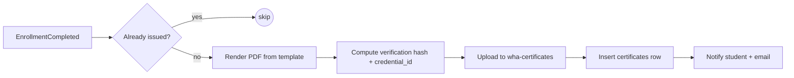

# 9 & 10. Certificate Generation and Course Progress

## Certificate Generation

Backs the certificate gallery, preview, download/share, and public verification.

### Trigger
`EnrollmentCompleted` (progress reaches 100% and any required quizzes passed) enqueues a **certificate generation job** (idempotent — one per `(user_id, course_id)`).

### Generation pipeline


- **Rendering:** HTML/React template → PDF via headless Chromium (Puppeteer) or a PDF lib; includes learner name, course title, grade, issue date, `credential_id`, instructor signature, and a **QR code** linking to the verification URL.
- **Credential ID:** human-readable, unique, e.g. `WHA-2026-<COURSECODE>-<seq>` (matches frontend samples like `WHA-2026-BID-0092`).
- **Verification hash:** HMAC/signature over `{userId, courseId, credentialId, issuedAt}` with a server key, stored in `verification_hash`. Tamper-evident.
- **Storage:** private `wha-certificates` bucket; download via short-lived signed URL (`GET /certificates/:id`).

### Verification (public, no PDF leak)
`GET /certificates/verify/:credentialId` → returns `{valid, learnerName, courseTitle, issuedAt, grade}` by looking up the row and checking the hash. The PDF itself is not exposed publicly — only the verified metadata. Optional: re-issue/revoke by admins (revoked credentials verify as invalid).

### Sharing
"Share" builds a LinkedIn "Add to profile" URL and a public verification link (not a direct file link).

---

## Course Progress Tracking

Backs Continue Learning, per-lesson completion, the player progress ring, and dashboard stats.

### Model
- Truth per lesson: `lesson_progress(enrollment_id, lesson_id, completed, watched_seconds, completed_at)`.
- Denormalized rollups on `enrollments`: `progress_pct`, `last_lesson_id`, `status`, `completed_at`, `last_accessed_at`.

### Update flow
```mermaid
sequenceDiagram
  participant P as Player
  participant A as API
  participant DB as Postgres
  P->>A: POST /learn/:courseId/lessons/:lessonId/progress {watchedSeconds, completed}
  A->>DB: upsert lesson_progress
  A->>DB: recompute enrollments.progress_pct = completed_lessons / total_lessons
  A->>DB: set last_lesson_id, last_accessed_at; status transitions
  alt progress_pct == 100 and required assessments passed
    A->>A: emit EnrollmentCompleted (→ certificate + achievement)
  end
  A-->>P: {progressPct, status}
```

- **Video watch tracking:** player POSTs heartbeats (e.g. every 15–30s and on pause/complete) with `watched_seconds`. A lesson auto-completes at ≥90% watched (configurable) or on explicit "Mark complete."
- **Debounce/throttle:** heartbeats are rate-limited and coalesced; the write path is cheap (upsert + counter update).
- **Completion definition:** course complete when all **required** lessons are complete and required quizzes passed (optional lessons excluded).
- **Resume:** `last_lesson_id` powers "Continue Learning"; the player deep-links `?lesson=`.
- **Streaks & study time:** a daily aggregation job rolls `lesson_progress`/attempt timestamps into study-time and streak metrics for analytics (§20) and achievements.

### Consistency
- Rollup updates run in the same transaction as the lesson upsert (or via the outbox) to keep `progress_pct` correct.
- Idempotent: re-posting the same completion is a no-op; certificates guarded by uniqueness.
