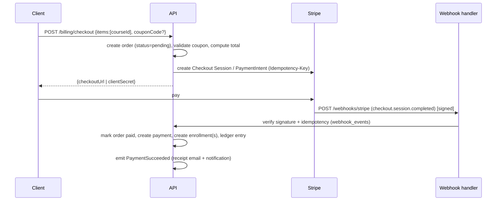
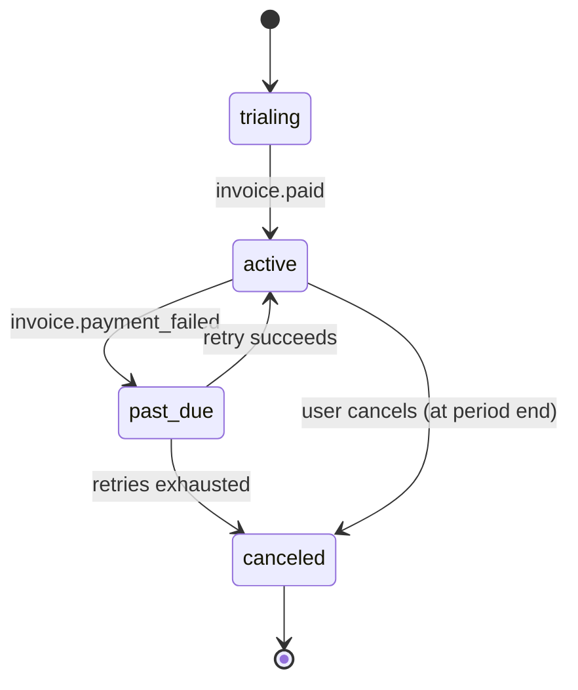

# 11 & 12. Payments and Subscriptions

**Provider:** Stripe (Checkout + Billing + Connect for instructor payouts). The app **never** touches raw card data — PCI scope stays with Stripe (the frontend already forbids entering card details directly).

## Payments

Supports two purchase modes seen in the catalog: **one-time course purchase** and **subscription** (all-access).

### Checkout flow (one-time)

- **Server computes price** — the client never sends amounts; it sends `courseId`/`planId` + optional coupon. Prevents tampering.
- **Idempotency:** `Idempotency-Key` on checkout; `webhook_events.event_id UNIQUE` makes webhook processing exactly-once.
- **Source of truth = webhooks**, not the client redirect. Enrollment is granted only after `checkout.session.completed`/`payment_intent.succeeded`.
- **Refunds:** admin-initiated → Stripe refund → `charge.refunded` webhook → order `refunded`, enrollment revoked, ledger reversed.
- **Coupons:** validated server-side (`coupons` table: percent/fixed, max redemptions, expiry); `POST /billing/coupons/validate` for UI preview.
- **Records:** `orders`, `order_items`, `payments`, all money in integer cents + currency.

### Instructor payouts (Connect)
- Each paid enrollment writes an `instructor_earnings` ledger row: `gross`, `platform_fee` (e.g. 30%), `net`, `available_at` (after a clearance window/refund window).
- `POST /instructor/payouts` requests a payout of the available balance → Stripe Connect transfer → `payouts` row; statuses tracked via webhook. Backs the instructor earnings page.

## Subscriptions

All-access model (`plans`: e.g. Monthly / Annual).

- `POST /billing/checkout {planId}` → Stripe subscription Checkout.
- Webhooks (`customer.subscription.created/updated/deleted`, `invoice.paid`, `invoice.payment_failed`) drive the `subscriptions` row: `status` (`trialing|active|past_due|canceled`), `current_period_end`, `cancel_at_period_end`.
- **Entitlement check:** access to subscription-gated courses = user has an `active`/`trialing` subscription. Enrollment `source='subscription'`. Enforced in the `/learn` and enrollment guards.
- **Dunning:** `past_due` triggers reminder notifications; grace period before access revocation.
- **Cancel:** `POST /billing/subscription/cancel {atPeriodEnd:true}` keeps access until period end.

### State machine

## Security & correctness notes
- Verify Stripe signatures on every webhook; reject unsigned/replayed.
- Reconcile nightly: compare Stripe charges vs `payments` to catch missed webhooks.
- Store `stripe_customer_id` on `users`, `stripe_subscription_id` on `subscriptions`, `stripe_account_id` on `instructor_profiles`.
- Tax/invoicing handled by Stripe Tax + hosted invoices.
