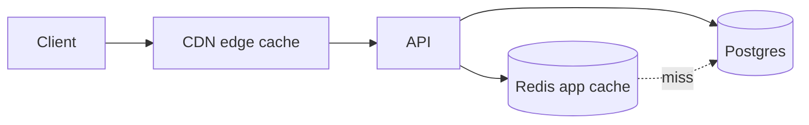

# 16, 17 & 18. API Versioning, Caching, Background Jobs

## API Versioning

- **URI versioning:** `/v1/...` (simple, cache-friendly, obvious in logs). Current: `v1`.
- **Policy:** additive changes (new fields/endpoints) are **non-breaking** and ship within `v1`. Breaking changes (removed/renamed fields, changed semantics) require `v2`, run in parallel, with a documented **deprecation window** (≥ 6 months).
- **Deprecation signaling:** `Deprecation` and `Sunset` response headers + `Warning`; deprecations tracked in the changelog and OpenAPI (`deprecated: true`).
- **Contract:** OpenAPI 3.1 is authoritative; the frontend regenerates types per version, so a version bump is a typed, reviewable diff.
- **Internal evolution:** DB migrations are backward-compatible (expand/contract pattern: add column → backfill → switch reads → drop) so deploys don't break in-flight `v1` traffic.

## Caching Strategy

Layered, from edge to database.

| Layer | What | Notes |
| --- | --- | --- |
| **CDN / edge** | Static assets, public avatars, HLS segments, public course catalog pages | long TTL + cache-bust on change; `stale-while-revalidate` |
| **HTTP** | Public `GET` endpoints (`/courses`, `/categories`) | `Cache-Control`, `ETag`/`If-None-Match` → `304` |
| **Redis application cache** | Hot, expensive reads: course detail, category tree, dashboard aggregates, permission maps, unread counts, rate-limit buckets, sessions | keyed, TTL + explicit invalidation |
| **DB** | Materialized views for heavy analytics; denormalized counters | refreshed by jobs |

- **Patterns:** cache-aside for reads; **write-through/invalidate on write** (e.g. publishing a course purges `course:{id}` and catalog list keys).
- **Keys & TTLs:** namespaced (`course:{id}`, `cat:tree`, `perm:{role}`, `dash:{userId}`); short TTLs for user-specific data (30–120s) + event-driven invalidation; long for near-static (category tree).
- **Stampede protection:** single-flight / lock on cache rebuild for hot keys.
- **Next.js side:** ISR/`revalidate` for public marketing/catalog pages; authenticated `/app` data is client-fetched (never cached across users).
- **Never cache:** authz-sensitive responses at shared layers; vary by user where needed.

## Background Jobs

**Queue:** BullMQ on Redis (or SQS + workers). Jobs are idempotent, retried with exponential backoff, and dead-lettered on repeated failure.

| Job | Trigger | Work |
| --- | --- | --- |
| `video.transcode` | media upload complete | HLS ladder, thumbnails, captions (§4) |
| `certificate.generate` | EnrollmentCompleted | render + sign + store PDF (§9) |
| `email.send` / `email.digest` | events / schedule | transactional + digest emails |
| `push.send` | events | web/mobile push |
| `search.index` | course/user/content change | upsert into search engine (§19) |
| `analytics.rollup` | schedule (hourly/daily) | study time, streaks, KPIs, materialized views (§20) |
| `report.generate` | admin request | build CSV → object storage → notify link |
| `payments.reconcile` | nightly | Stripe vs `payments` reconciliation |
| `media.gc` | nightly | delete stale/incomplete uploads, raw video |
| `notifications.fanout` | events | multi-channel delivery |
| `token.cleanup` | schedule | purge expired tokens/resets |
| `achievements.evaluate` | learning events | unlock badges |

- **Scheduling:** cron-style repeatable jobs (BullMQ repeat / a scheduler) for digests, rollups, reconciliation, GC.
- **Delivery semantics:** at-least-once + idempotency keys so retries are safe.
- **Observability:** queue dashboards (Bull Board), metrics on depth/latency/failure, alerts on backlog.
- **Isolation:** workers run as separate deployables from the API so heavy CPU (transcode, PDF) doesn't affect request latency and scales independently.
- **Outbox relay:** a poller moves `outbox` rows → queue, guaranteeing events survive crashes (used by notifications, search indexing, audit).
