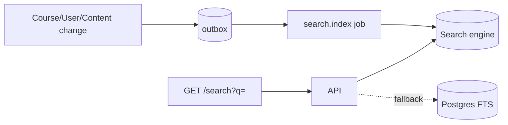
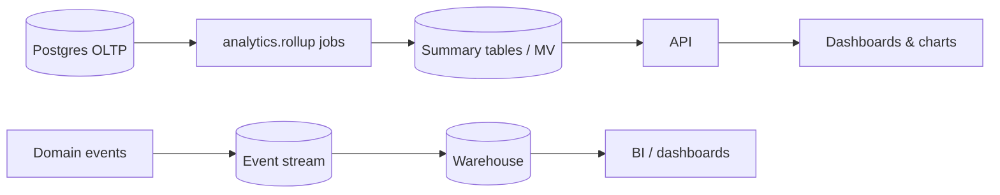

# 19 & 20. Search and Analytics

## Search Architecture

Backs `/app/search` (course, instructor, blog results + suggestions + popular + recent).

### Engine
- **Primary:** Meilisearch (fast, typo-tolerant, simple) — or OpenSearch/Elasticsearch at larger scale.
- **Fallback:** Postgres full-text (GIN) so search still works if the engine is unavailable.

### Indexes
| Index | Fields (searchable) | Filters / facets | Ranking |
| --- | --- | --- | --- |
| `courses` | title, subtitle, description, tags, instructor name | category, level, price(free/paid), rating | popularity (students, rating), recency, text score |
| `instructors` | name, headline, bio, skills | — | student count, rating |
| `blog` | title, excerpt, body | tags | recency |

### Indexing pipeline

- Documents are (re)indexed asynchronously via the `search.index` job on create/update/publish/delete (only **published, non-deleted** courses are visible).
- Full reindex job available for schema changes.

### Query API
- `GET /search?q=&type=all|courses|instructors|blog&category=&level=&sort=` → grouped, paginated results with highlights.
- `GET /search/suggestions?q=` → autocomplete (prefix + typo tolerance).
- `GET /search/popular` → trending queries (from analytics).
- **Recent searches** stored client-side (localStorage) and optionally per-user server-side.
- Personalization/relevance tuning and synonyms configurable; results respect entitlement (no unpublished/private content).

## Analytics Architecture

Backs student analytics, instructor analytics, and admin dashboards. Separates **write-optimized OLTP** from **read-optimized analytics** to avoid heavy queries on the transactional DB.

### Approach (staged by scale)
1. **Now (small/medium):** nightly/hourly **rollup jobs** compute aggregates into summary tables / **materialized views**; dashboards read those. Cheap and simple.
2. **Later (large):** emit domain **events** to an event stream → warehouse (BigQuery / ClickHouse / Redshift) → BI + product analytics.

### Metrics by consumer
| Consumer | Metrics (maps to UI) |
| --- | --- |
| **Student** | learning hours (weekly), weekly progress, completion rate, quiz scores, current/longest streak, goals |
| **Instructor** | students, active courses, avg rating, monthly earnings & enrollments, ratings distribution, top content |
| **Admin** | total users, active courses, monthly revenue, refund rate, revenue trend, signups trend, users-by-role, top courses by sales/revenue |

### Endpoints
`GET /analytics/me`, `GET /instructor/analytics`, `GET /admin/analytics` — each returns the pre-aggregated payloads the charts already expect (area/bar/donut series), served from summary tables + Redis cache.

### Pipeline notes
- **Source signals:** `lesson_progress` timestamps (study time/streaks), `quiz_attempts` (scores), `orders`/`payments` (revenue), `enrollments` (growth/completion), `reviews` (ratings), search logs (popular queries).
- **Freshness:** near-real-time counters (Redis) for "today"; batch rollups for historical series.
- **Consistency:** analytics are eventually consistent; dashboards show "as of" timestamps where relevant.
- **Privacy:** analytics aggregate/anonymize; no PII in the warehouse beyond necessary keys.
