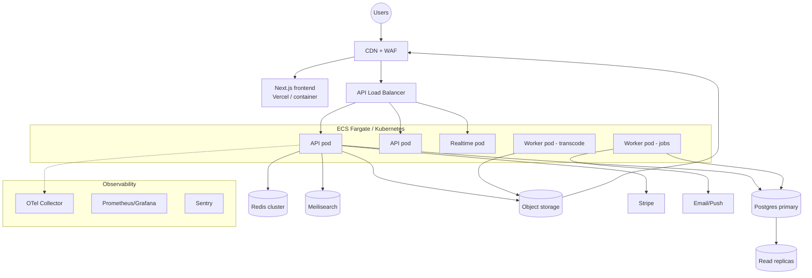

# 23 & 24. Deployment Architecture and Scalability

## Deployment Architecture

Stateless, containerized services behind a load balancer; managed data stores; global CDN.

### Environments
- **local:** Docker Compose (Postgres, Redis, MinIO, Meilisearch) + `.env`.
- **preview:** ephemeral per-PR (frontend on Vercel preview; API on a shared staging cluster with seeded data).
- **staging:** production-like, smoke + e2e tests, migration dry-runs.
- **production:** multi-AZ, autoscaled.

### Pipeline (CI/CD)
1. PR: install → **lint + typecheck + unit/e2e (Testcontainers)** → build image.
2. Merge to main: push image to registry → deploy to staging → run migrations (expand phase) → smoke tests.
3. Promote: **blue-green / rolling** deploy to prod → health checks → shift traffic → contract-phase migrations later.
- **Migrations** run as a separate step (`prisma migrate deploy`), backward-compatible (expand/contract) so old and new pods coexist during rollout.
- **Rollback:** previous image + down-safe migrations; feature flags to dark-launch/kill features without redeploy.

### Runtime concerns
- **Config** via env + secrets manager; **12-factor**.
- **Zero-downtime:** readiness/liveness probes (`/ready`, `/health`), graceful shutdown (drain WS + queue), connection pooling (PgBouncer).
- **Separation:** API pods, realtime pods, and worker pods deploy and scale independently.

## Scalability Plan

Staged — don't pre-build for scale you don't have.

### Stateless horizontal scaling
- API and workers are stateless → scale out on CPU/RPS/queue-depth (HPA / target-tracking).
- All shared state in Postgres/Redis/S3; sticky sessions **not** required (WS uses Redis adapter for cross-node fan-out).

### Database
- **Vertical first**, then **read replicas** for read-heavy endpoints (catalog, analytics reads) via a read/write split in the repository layer.
- **PgBouncer** connection pooling.
- **Partitioning** for large append-only tables (`audit_logs`, `notifications`, `lesson_progress`) by time/hash.
- **Denormalized counters + materialized views** keep hot list/dashboard queries O(1).
- Future: shard by tenant/user, or move analytics to a warehouse (§20) to offload OLTP.

### Caching & offload
- Multi-layer cache (§17); CDN absorbs public catalog + media traffic.
- Signed media served directly from CDN — video bytes never traverse the API.

### Async & spikes
- Heavy work (transcode, PDFs, emails, indexing) is queued → smooths spikes; workers autoscale on queue depth; DLQ for failures.
- Rate limiting (§15) protects against abuse-driven load.

### Realtime at scale
- WS nodes scale horizontally; Redis Pub/Sub (or Streams / a managed service) for fan-out; presence via Redis TTL keys.

### Reliability targets & practice
- **Multi-AZ** data stores with automated failover; **PITR backups** (Postgres) + cross-region replication for critical buckets.
- **SLO:** API p99 < 300ms for cached reads; 99.9% availability target.
- **Load/chaos testing** before major launches; capacity headroom alarms.
- **Cost controls:** autoscale to zero for workers when idle, storage lifecycle tiers, right-sized instances.

### Extraction path (monolith → services)
The modular monolith (§21) lets us peel off independently-scaling contexts when metrics justify it — likely order: **media/transcoding**, **realtime/messaging**, **search indexing**, **analytics** — each already communicating via events with clean boundaries.
