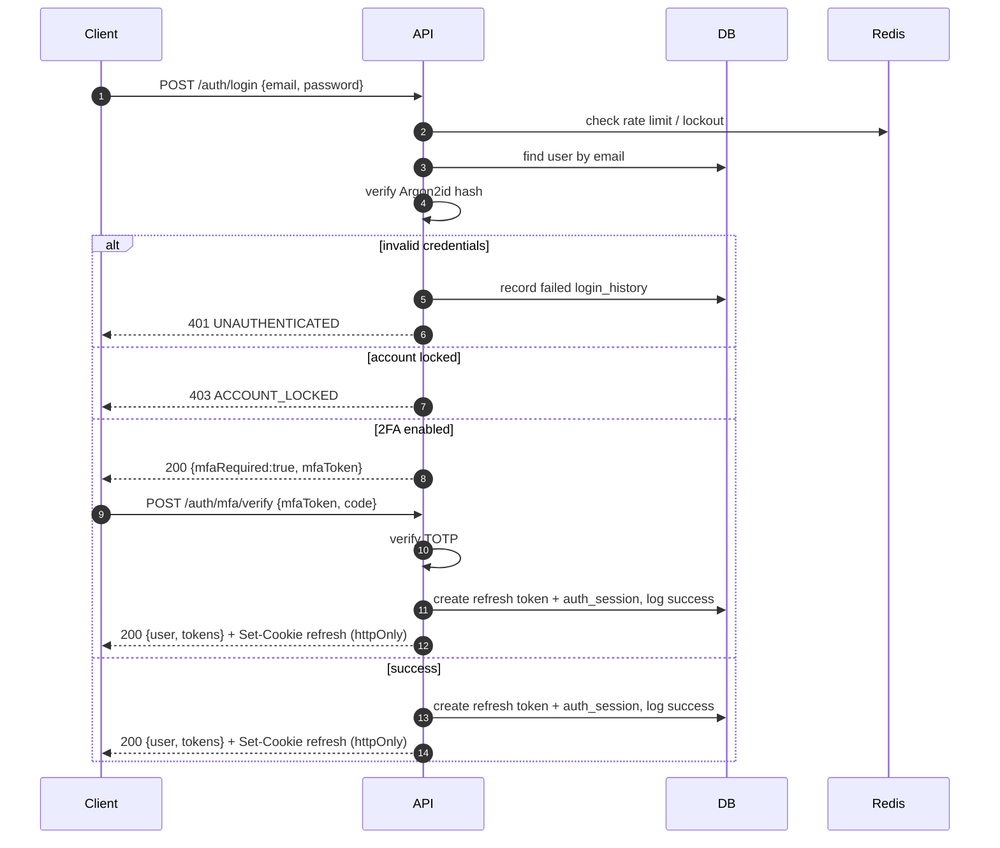
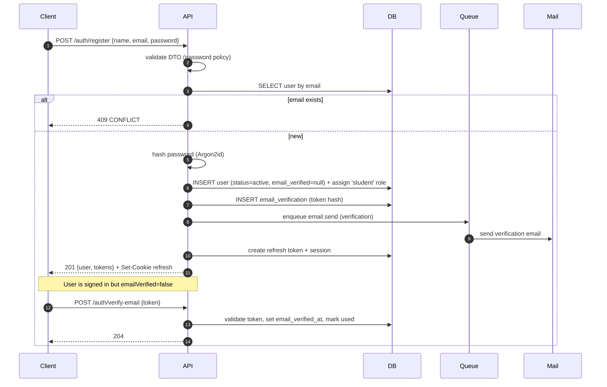
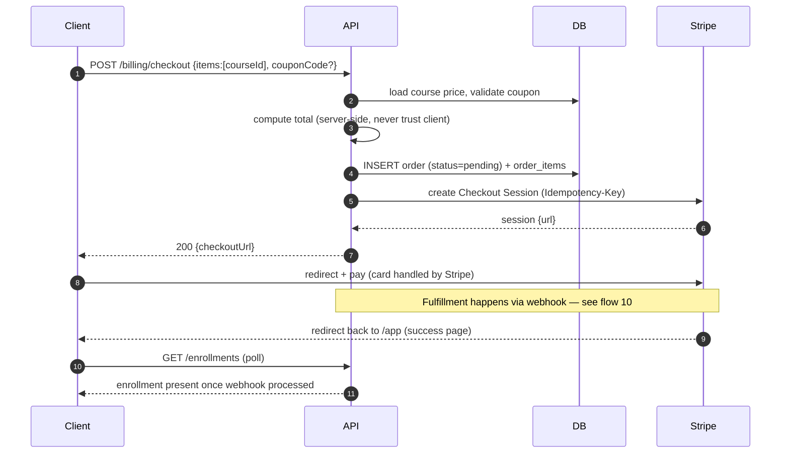
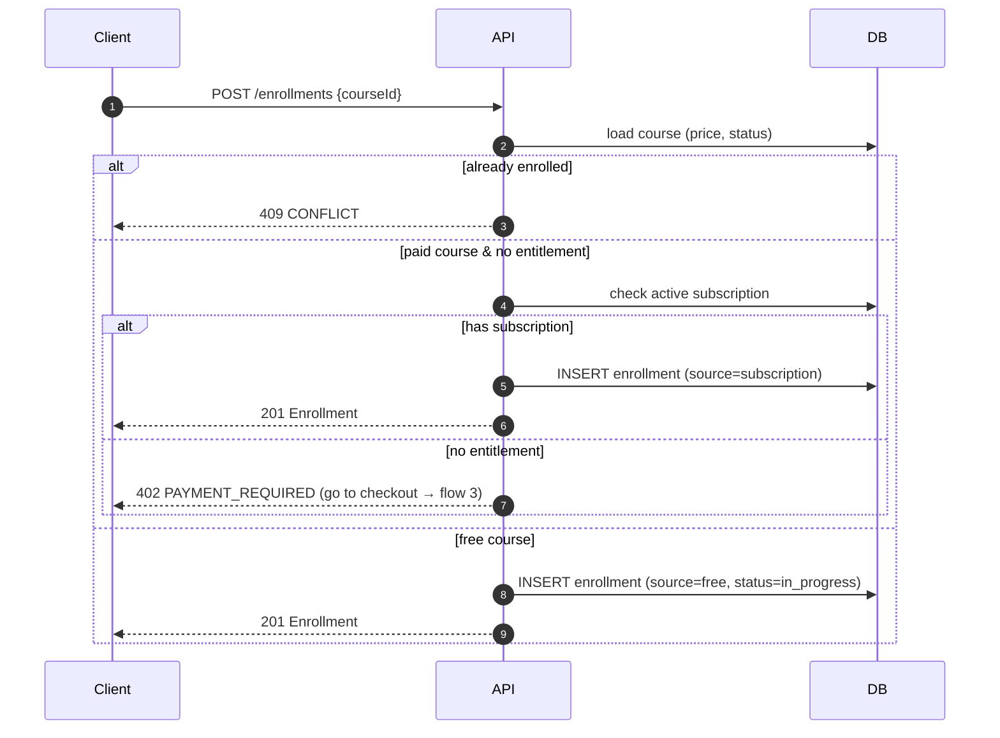
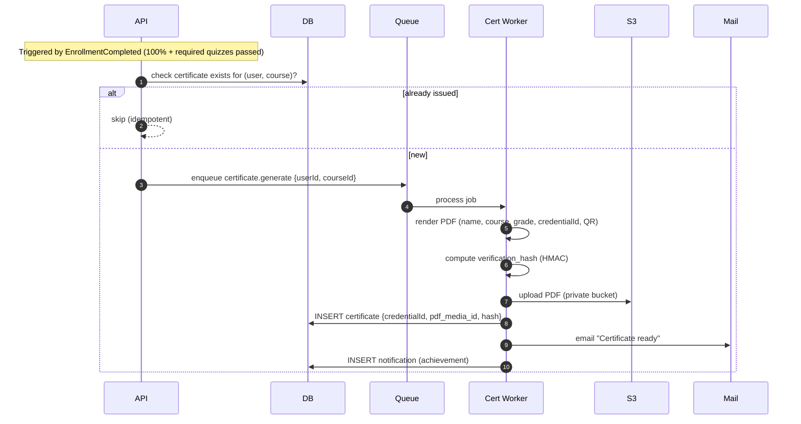
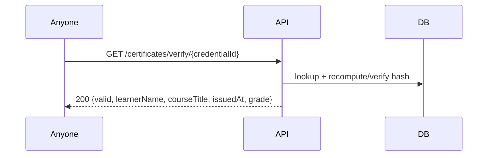

# Flow Diagrams

Sequence diagrams for the core WebHack Academy flows, grounded in the auth (§3),
storage (§4), payments (§11), and jobs (§18) designs. Participants: **C** client,
**API** NestJS API, **DB** PostgreSQL, **R** Redis, **S3** object storage/CDN,
**Q** job queue, **Stripe**, **Mail** email provider.

## 1. Login



## 2. Signup



## 3. Purchase Course



## 4. Enroll Course (free / subscription)



## 5. Watch Video

```mermaid
sequenceDiagram
  autonumber
  participant C as Client (player)
  participant API
  participant DB
  participant CDN as CDN / S3
  C->>API: GET /media/{lessonMediaId}
  API->>DB: authorize (enrolled? preview? role)
  alt not entitled
    API-->>C: 403 FORBIDDEN
  else entitled
    API->>API: mint short-lived playback token (user+session bound)
    API-->>C: 200 {signed HLS url, expiresAt}
    C->>CDN: GET .m3u8 + segments (signed)
    CDN-->>C: video stream
    loop every ~20s / on pause / on end
      C->>API: POST /learn/{courseId}/lessons/{lessonId}/progress {watchedSeconds, completed}
      API->>DB: upsert lesson_progress; recompute enrollment.progress_pct; set last_lesson
      API-->>C: 200 {progressPct, status}
    end
    Note over API,DB: If progress hits 100% → emit EnrollmentCompleted (flow 8)
  end
```

## 6. Submit Quiz

```mermaid
sequenceDiagram
  autonumber
  participant C as Client
  participant API
  participant DB
  C->>API: POST /quizzes/{id}/attempts
  API->>DB: enforce max_attempts; INSERT attempt (started_at, ends_at)
  API-->>C: 201 {attemptId, endsAt}
  loop while answering
    C->>API: PATCH /attempts/{aid} {answers}  (autosave)
    API->>DB: persist partial answers
  end
  C->>API: POST /attempts/{aid}/submit {answers}
  API->>API: check now <= ends_at (+grace); grade server-side per question type
  API->>DB: INSERT quiz_answers; UPDATE attempt {score, passed, submitted_at}
  API->>API: emit QuizSubmitted (analytics, achievements)
  API-->>C: 200 {score, passed, breakdown[with explanations]}
```

## 7. Submit Assignment

```mermaid
sequenceDiagram
  autonumber
  participant C as Client
  participant API
  participant S3
  participant Q as Queue
  participant DB
  Note over C,S3: Files upload directly via presigned URLs (§4)
  C->>API: POST /media/uploads {filename, mime, size, kind}
  API-->>C: {mediaId, uploadUrl}
  C->>S3: PUT file
  C->>API: POST /media/uploads/{id}/complete
  API->>Q: enqueue malware scan
  C->>API: POST /assignments/{id}/submissions {attachments:[mediaId], comment}
  API->>DB: validate ownership + media ready; UPSERT submission (status=submitted, submitted_at)
  API->>API: emit AssignmentSubmitted (notify instructor)
  API-->>C: 201 Assignment (status=submitted)
```

## 8. Generate Certificate



Public verification later:


## 9. Forgot Password

```mermaid
sequenceDiagram
  autonumber
  participant C as Client
  participant API
  participant DB
  participant Q as Queue
  participant Mail
  C->>API: POST /auth/forgot-password {email}
  API->>DB: find user (do NOT reveal existence)
  opt user exists
    API->>DB: INSERT password_reset (token hash, expiry, single-use)
    API->>Q: enqueue email.send (reset link)
    Q->>Mail: send reset email
  end
  API-->>C: 202 Accepted (always — no user enumeration)
  C->>API: POST /auth/reset-password {token, password}
  API->>DB: validate token (unused, unexpired); update password_hash; mark used
  API->>DB: revoke all refresh token families (force re-login)
  API-->>C: 204 No Content
```

## 10. Payment Webhook

```mermaid
sequenceDiagram
  autonumber
  participant Stripe
  participant API as API (/webhooks/stripe)
  participant DB
  participant Q as Queue
  Stripe->>API: POST event (checkout.session.completed) [signed]
  API->>API: verify Stripe signature
  alt invalid signature
    API-->>Stripe: 400 (reject)
  else valid
    API->>DB: INSERT webhook_events(event_id) — UNIQUE
    alt duplicate event_id
      API-->>Stripe: 200 (idempotent no-op)
    else first time
      API->>DB: mark order paid; INSERT payment
      API->>DB: INSERT enrollment(s) (source=purchase)
      API->>DB: INSERT instructor_earnings ledger (gross/fee/net)
      API->>Q: enqueue receipt email + PaymentSucceeded notification
      API->>DB: mark webhook_events.processed_at
      API-->>Stripe: 200 OK
    end
  end
```

> Reliability: the webhook is the **source of truth** for fulfilment (not the browser
> redirect). `webhook_events.event_id` guarantees exactly-once processing; a nightly
> reconciliation job compares Stripe charges against `payments` to catch any missed events.
