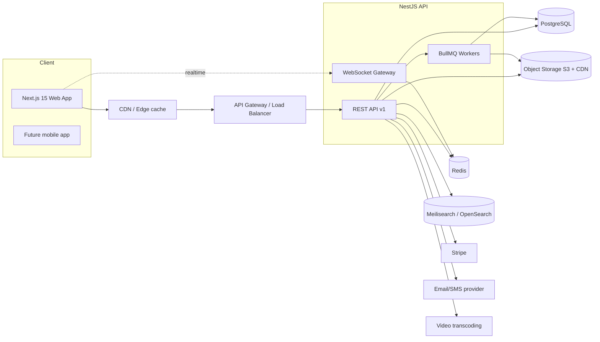

# WebHack Academy — Backend Architecture Specification

> **Status:** Design specification only. **No backend is implemented yet.**
> This document set describes the backend that the existing Next.js 15 frontend
> (`src/`) is already architected to consume. The frontend talks to a **mock service
> layer** (`src/services/*.service.ts`) whose contracts are defined in
> `src/types/index.ts`. This spec turns those contracts into a real backend design so
> that, at implementation time, the mock services are swapped for HTTP calls with
> **no change to the UI**.

## How the frontend maps to the backend

| Frontend artifact | Becomes |
| --- | --- |
| `src/types/index.ts` | Canonical domain model → database tables + API DTOs |
| `src/services/*.service.ts` | One backend module/controller per service |
| `src/mocks/db.ts` | Seed/fixtures for the real database |
| `useAsync` + loading/error states | REST responses + standard error envelope |
| `useAuth` store (JWT-shaped session) | JWT access + refresh token auth |
| Role switcher (student/instructor/admin) | RBAC roles + permissions |

## Document index (covers all 24 requested topics)

| # | Topic | Document |
| --- | --- | --- |
| 1 | Database Schema (entities, ERD, PK/FK, indexes) | [01-database-schema.md](./01-database-schema.md) |
| 2 | API Specification (endpoints, methods, bodies, errors, auth) | [02-api-specification.md](./02-api-specification.md) |
| 3 | Authentication & Authorization (JWT, refresh, RBAC) | [03-auth-and-rbac.md](./03-auth-and-rbac.md) |
| 4 | File Storage Strategy | [04-file-storage.md](./04-file-storage.md) |
| 5 | Notification System | [05-notifications-and-messaging.md](./05-notifications-and-messaging.md#notification-system) |
| 6 | Messaging System | [05-notifications-and-messaging.md](./05-notifications-and-messaging.md#messaging-system) |
| 7 | Quiz Engine Design | [06-quiz-and-assignments.md](./06-quiz-and-assignments.md#quiz-engine) |
| 8 | Assignment System Design | [06-quiz-and-assignments.md](./06-quiz-and-assignments.md#assignment-system) |
| 9 | Certificate Generation Design | [07-certificates-and-progress.md](./07-certificates-and-progress.md#certificate-generation) |
| 10 | Course Progress Tracking | [07-certificates-and-progress.md](./07-certificates-and-progress.md#course-progress-tracking) |
| 11 | Payments Architecture | [08-payments-and-subscriptions.md](./08-payments-and-subscriptions.md#payments) |
| 12 | Subscription Model | [08-payments-and-subscriptions.md](./08-payments-and-subscriptions.md#subscriptions) |
| 13 | Audit Logging | [09-security-audit-ratelimit.md](./09-security-audit-ratelimit.md#audit-logging) |
| 14 | Security Architecture | [09-security-audit-ratelimit.md](./09-security-audit-ratelimit.md#security-architecture) |
| 15 | Rate Limiting | [09-security-audit-ratelimit.md](./09-security-audit-ratelimit.md#rate-limiting) |
| 16 | API Versioning | [10-api-infrastructure.md](./10-api-infrastructure.md#api-versioning) |
| 17 | Caching Strategy | [10-api-infrastructure.md](./10-api-infrastructure.md#caching-strategy) |
| 18 | Background Jobs | [10-api-infrastructure.md](./10-api-infrastructure.md#background-jobs) |
| 19 | Search Architecture | [11-search-and-analytics.md](./11-search-and-analytics.md#search-architecture) |
| 20 | Analytics Architecture | [11-search-and-analytics.md](./11-search-and-analytics.md#analytics-architecture) |
| 21 | Folder Structure | [12-folder-structure.md](./12-folder-structure.md) |
| 22 | Recommended Tech Stack | [13-tech-stack.md](./13-tech-stack.md) |
| 23 | Deployment Architecture | [14-deployment-and-scalability.md](./14-deployment-and-scalability.md#deployment-architecture) |
| 24 | Scalability Plan | [14-deployment-and-scalability.md](./14-deployment-and-scalability.md#scalability-plan) |

## Supplementary references

| Doc | Contents |
| --- | --- |
| [15-permissions-matrix.md](./15-permissions-matrix.md) | Full RBAC capability matrix across all 5 roles (Create Course, Delete User, Publish Course, and the rest) with permission keys |
| [16-flow-diagrams.md](./16-flow-diagrams.md) | Mermaid sequence diagrams: Login, Signup, Purchase, Enroll, Watch Video, Submit Quiz, Submit Assignment, Generate Certificate, Forgot Password, Payment Webhook |
| [prisma/](./prisma/) | `schema.prisma` + generated init migration (see §1) |

## Contract artifacts (generated deliverables)

| Artifact | Location | Purpose |
| --- | --- | --- |
| **OpenAPI 3.1 spec** | [`api/openapi.yaml`](./api/openapi.yaml) | Machine-readable contract — 47 paths, 63 schemas. Source for generated frontend types. |
| **Swagger UI viewer** | [`api/swagger-ui.html`](./api/swagger-ui.html) | Standalone browser viewer for the spec (serve over HTTP: `npx http-server docs/backend/api`). |
| **NestJS Swagger setup** | [`api/nest-swagger-setup.ts`](./api/nest-swagger-setup.ts) | Bootstrap that auto-generates the spec + serves `/v1/docs` from decorators. |
| **Validation rules** | [`api/VALIDATION.md`](./api/VALIDATION.md) | Field-level rules reference. |
| **Request DTOs** | [`dtos/`](./dtos/) | `class-validator` + `@nestjs/swagger` DTOs (executable validation). |

> The DTOs and `.ts` setup file are **backend reference code**; `docs/` is excluded from
> the frontend `tsconfig`, so they never affect `next build`.

## System context (high level)

## Guiding principles

1. **Contract-first** — the OpenAPI spec (§2) is the source of truth; frontend types are generated from it.
2. **Stateless API** — horizontal scaling; all shared state in PostgreSQL / Redis / object storage.
3. **Single language** — TypeScript across frontend and backend to share DTOs and validation (Zod ⇄ class-validator).
4. **Least privilege** — RBAC + resource ownership checks on every mutating endpoint.
5. **Async by default** — anything slow (video transcode, certificate PDF, emails, search indexing) runs as a background job.
